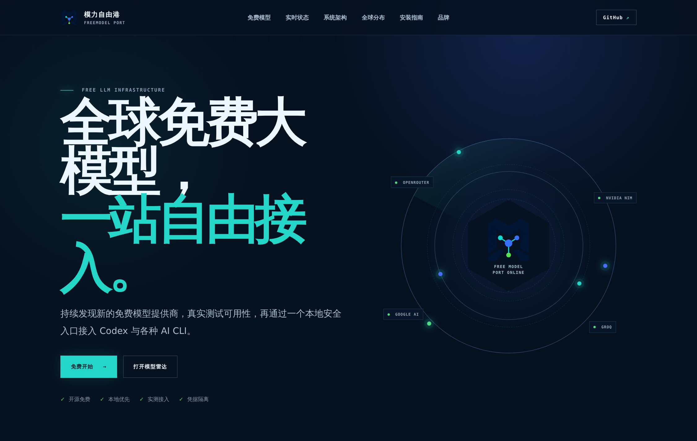
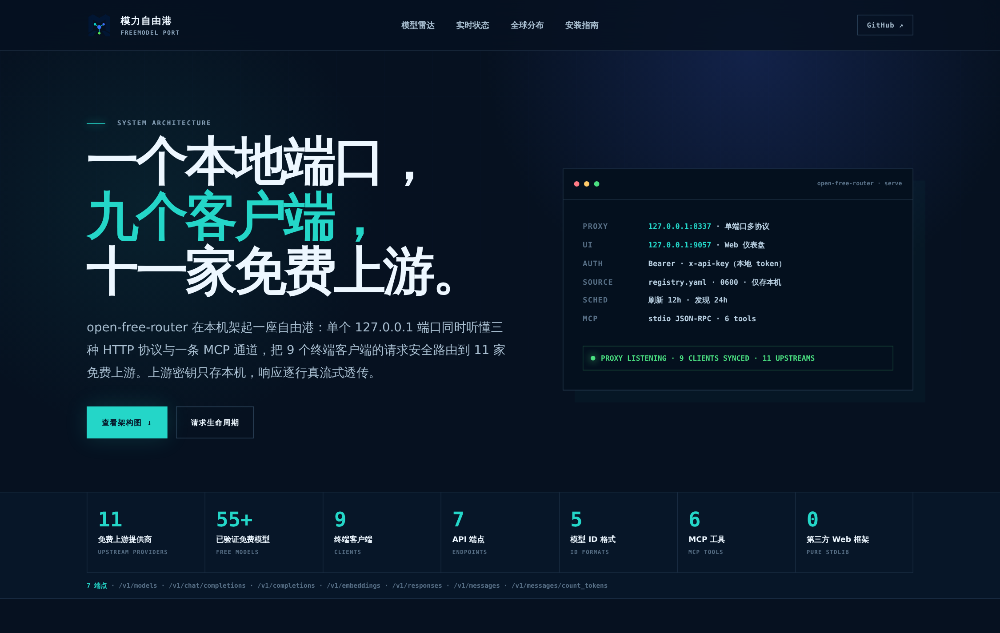
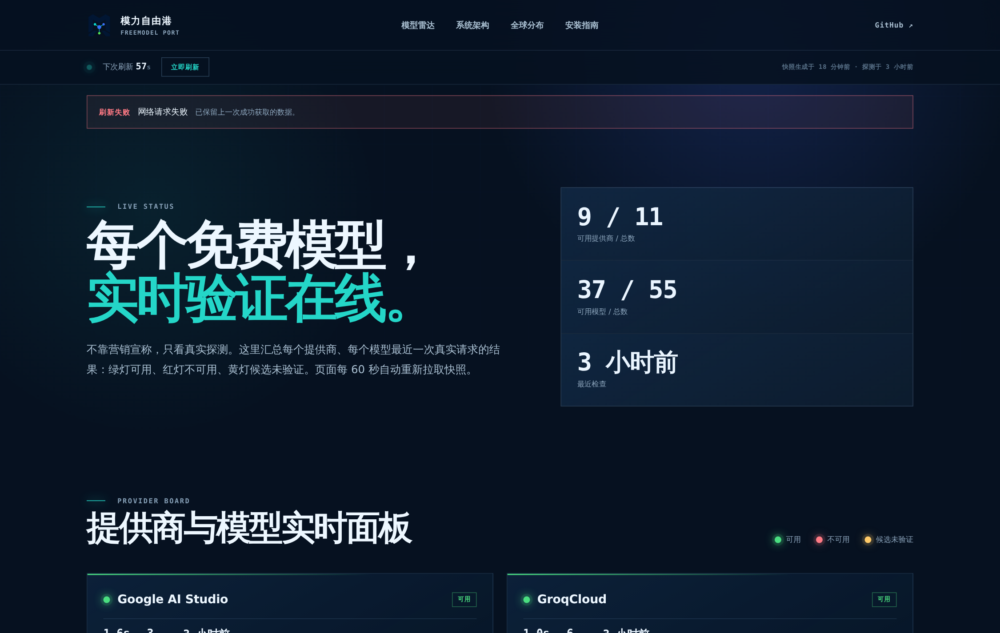
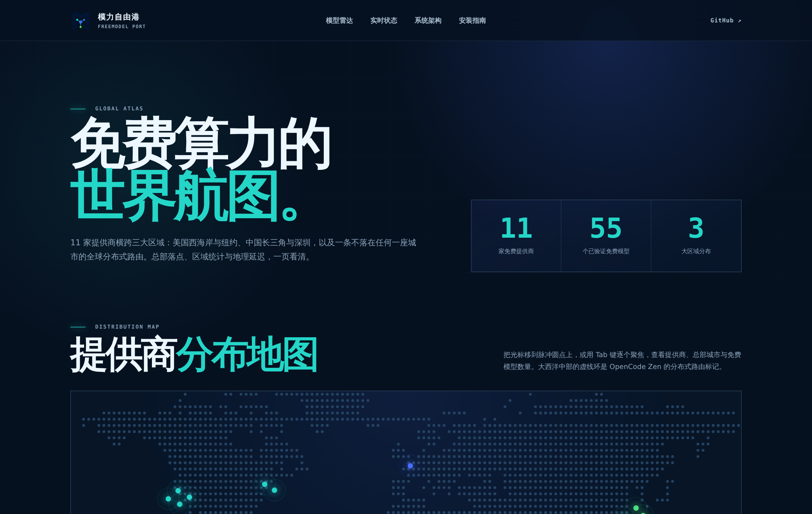
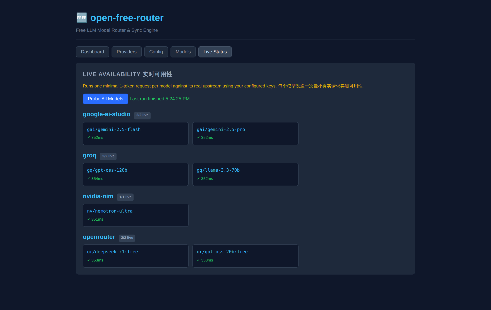
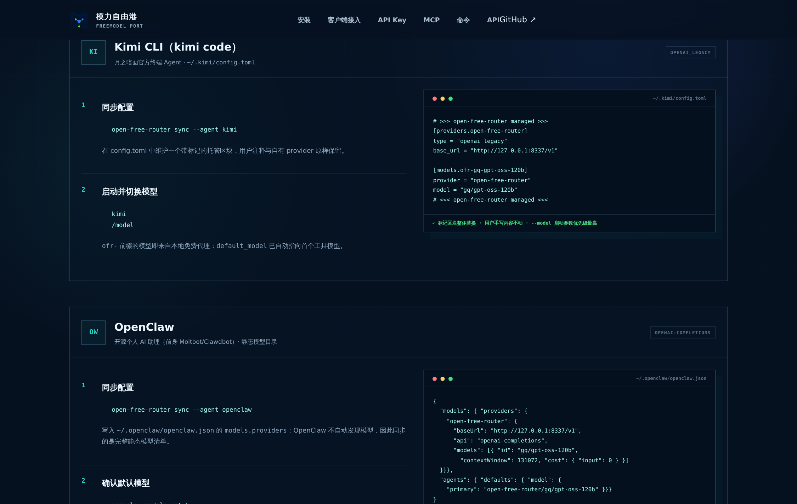

# 模力自由港 · FreeModel Port

> **全球免费大模型，一站发现、实测、接入。** 由 Open Free Router 提供技术引擎。

🌐 **项目网站：** [oaf.asia](https://oaf.asia) · [安装指南](https://oaf.asia/guide/) · [模型雷达](https://oaf.asia/models/) · [实时状态](https://oaf.asia/status/) · [系统架构](https://oaf.asia/architecture/) · [全球分布](https://oaf.asia/map/) · [品牌](https://oaf.asia/brand/)

> **来源说明：** 本仓库基于原始项目
> [`NoelJudeNoel/open-free-router`](https://github.com/NoelJudeNoel/open-free-router)
> 继续开发，遵循 MIT License。当前版本由 `zhanglunet` 独立维护，新增
> Codex Responses API、Anthropic Messages API（Claude Code）、九客户端
> 同步、MCP 服务器、实时可用性探测、安全鉴权、第三方模型目录、
> Gemini 工具调用兼容、扩展测试与项目文档网站。详见 [`NOTICE.md`](NOTICE.md)。

**一条命令跑起所有服务：** proxy(8337) + UI(9057) + 定时刷新(12h)

```bash
curl -fsSLo /tmp/open-free-router-install.sh https://oaf.asia/install.sh
less /tmp/open-free-router-install.sh
bash /tmp/open-free-router-install.sh --codex --auto-discovery
```

追踪 11 个 LLM 提供商的免费模型（OpenRouter、NVIDIA NIM、OpenCode Zen、Nous Research、StepFun、SenseNova、Groq、Google AI Studio、DeepSeek、Poolside AI、Gitee AI），运行本地代理按模型 ID 路由到对应上游，自动刷新模型列表。一次配置，**9 个客户端**共享模型：Codex、Claude Code、OpenCode、Hermes、Kimi CLI、OpenClaw、WorkBuddy、Pi、OMP；另有内置 MCP 服务器供任意 MCP 宿主调用。

## 网站预览

| 首页 | 系统架构 |
|---|---|
|  |  |

| 实时状态 | 全球分布 |
|---|---|
|  |  |

| 本地仪表盘 · Live Status 实测 | 模型雷达 · API Key 指引 |
|---|---|
|  |  |

| 分客户端图文接入指南 |
|---|
|  |

## 客户端支持矩阵

| 客户端 | 协议 | 一条命令 | 写入位置 |
|---|---|---|---|
| **Codex CLI** | Responses API | `sync --agent codex` | `~/.codex/open-free-router.config.toml`（独立 profile） |
| **Claude Code** | Anthropic Messages | `sync --agent claude` | `~/.claude/settings.json` `env` 块（合并写入） |
| **OpenCode** | Chat Completions | `sync --agent opencode` | `~/.config/opencode/opencode.jsonc` |
| **Hermes** | Chat Completions | `sync --agent hermes` | `~/.hermes/config.yaml`（模型运行时自动发现） |
| **Kimi CLI**（kimi code） | Chat Completions | `sync --agent kimi` | `~/.kimi/config.toml`（托管标记块） |
| **OpenClaw** | Chat Completions | `sync --agent openclaw` | `~/.openclaw/openclaw.json`（静态模型目录） |
| **WorkBuddy** | Chat Completions | `sync --agent workbuddy` | `~/.workbuddy/models.json`（重启生效） |
| **Pi / OMP** | Chat Completions | serve 自动维护 | `~/.pi/agent/models.json` / `~/.omp/agent/models.yml` |
| **MCP 宿主** | MCP (stdio) | `claude mcp add … -- open-free-router mcp` | 任意 `mcpServers` 配置 |

所有客户端只拿到**本地代理 token**，上游 API Key 永远留在本机 `registry.yaml`。
默认 `sync` 只写检测到已安装的客户端；显式 `--agent NAME` 可强制创建配置。
详细图文步骤见 [安装指南](https://oaf.asia/guide/#clients)。

## 安装

**方式一：一键安装（推荐）**
```bash
bash <(curl -fsSL https://raw.githubusercontent.com/zhanglunet/open-free-router/main/scripts/install.sh)
```

安装后打开 systemd 开机自启：
```bash
bash <(curl -fsSL ...) --with-systemd
```

**方式二：手动安装**
```bash
git clone https://github.com/zhanglunet/open-free-router.git
cd open-free-router
python3 -m venv .venv
source .venv/bin/activate
pip install -e .
```

## 命令

| 命令 | 说明 |
|---|---|
| `open-free-router serve` | **★ 一条命令启动：** proxy(8337) + UI(9057) + 定时刷新(12h) |
| `open-free-router setup` | 交互式向导：填写各上游源 API key |
| `open-free-router refresh [--source NAME] [--dry-run]` | 拉取免费模型列表 |
| `open-free-router discover [--dry-run]` | 从公开目录发现待人工验证的候选免费提供商 |
| `open-free-router discover --test --adopt` | 用声明的环境变量实测候选，只接入真实成功模型 |
| `open-free-router add NAME --base-url URL [--model ID] [--auto-refresh]` | 添加 provider |
| `open-free-router sync --agent codex,claude,kimi,…` | 同步 9 个客户端配置；`--codex-model` / `--claude-model` 指定默认模型 |
| `open-free-router mcp [--print-config]` | 内置 MCP stdio 服务器；`--print-config` 打印宿主注册片段 |
| `open-free-router status [--json]` | 一屏健康摘要（注册表 / 密钥 / 端口可达性） |
| `open-free-router models [--json]` | 列出全部模型与能力标记（T=工具 R=推理） |
| `open-free-router route explain MODEL [--json]` | 离线解释虚拟/显式模型的候选顺序，不发起推理 |
| `open-free-router resilience [--json]` | 查看运行中代理的 Provider/Key 槽位/模型故障隔离状态 |
| `open-free-router resilience reset --provider NAME [--model ID]` | 精确重置 Provider 或单模型运行时状态 |
| `open-free-router metrics [--days 30] [--json]` | 查看本机最小化使用分析：成功率、p50/p95、Fallback 与 Token |
| `open-free-router metrics --export json\|csv [--output PATH]` | 导出经过字段白名单与敏感值检查的本机统计 |
| `open-free-router doctor [--json]` | 安装与路由体检：定位 YAML 路径并给出修复命令；支持结构化输出 |
| `open-free-router token` | 输出本地推理代理 token，供命令式鉴权使用 |
| `open-free-router ui` | 单独启动 Web 仪表盘（调试用） |

自动接入是显式启用的安全功能：只接受 models.dev 声明为 OpenAI
兼容的公网 HTTPS 端点，要求用户主动提供对应环境变量，并通过真实的最小
Chat Completions 请求。registry 只保存环境变量名，不复制密钥值。

## 快速开始

```bash
# 1. 首次运行自动创建配置，直接启动
open-free-router serve

# 2. 在新终端中填入 API key
open-free-router setup

# 3. 把 Agent 的 base_url 指向 http://127.0.0.1:8337/v1

# 4. 打开仪表盘：http://127.0.0.1:9057

# 5. 可选：接入 Codex（默认选择首个 tool_calling 模型）
open-free-router sync --agent codex --codex-model gq/gpt-oss-120b
codex --profile open-free-router
```

## 配置文件

`~/.config/open-free-router/config.yaml`：

```yaml
registry: ~/.config/open-free-router/registry.yaml

proxy:
  host: 127.0.0.1
  port: 8337

ui:
  host: 127.0.0.1
  port: 9057

refresh_interval_hours: 12

discovery:
  enabled: true
  interval_hours: 24
  auto_test: false       # 显式开启后，测试专用 OFR_*_API_KEY 变量
  auto_adopt: false      # 只接入真实请求成功的模型
  max_providers_per_cycle: 5
  max_models_per_provider: 3

analytics:
  retention_days: 30    # 仅保存最小化本机元数据；设为 0 完全关闭并不创建数据库

routing:
  aliases:
    auto/coding:
      require:
        tool_calling: true
      # 可选：省略 candidates 时按注册表顺序选择全部符合能力的模型
      candidates: [gq/gpt-oss-120b, gq/gpt-oss-20b]
  fallback:
    enabled: true
    max_attempts: 3
    explicit_model: false  # 显式模型默认不静默换模
  scoring:
    enabled: false         # 默认关闭；true 时启用可解释智能评分
    missing_default: 0.5   # 指标缺失时的明确默认分
    latency_good_ms: 500
    latency_bad_ms: 10000
    weights:
      health: 0.25
      success_rate: 0.20
      latency: 0.20
      quota: 0.15
      capability: 0.10
      free_evidence: 0.10
```

内置虚拟模型为 `auto`、`auto/coding`、`auto/fast`、`auto/free`。当前开发
版本已完成确定性候选计划，以及 Chat、Responses、Messages 共用的首字节前
安全 fallback：虚拟模型可在 Key 失效、429、模型下线或上游 5xx 时切换候选；
显式模型默认不静默换模。流式响应一旦向客户端发送响应头/事件便不再重放。
可先运行 `open-free-router route explain auto/coding --json` 检查候选，不会
消耗免费额度。

开启 `routing.scoring.enabled` 后，虚拟模型候选会按健康状态、近期成功率、
p95 首字节/总延迟、额度余量、能力匹配和免费证据进行 `[0,1]` 归一化评分。
权重自动归一化，NaN 和缺失指标使用 `missing_default`，同分时仍保持注册表顺序。
`open-free-router route explain auto --json` 会给出每项取值、权重、贡献和来源；
本地仪表盘的最近路由决策也可展开查看。关闭开关后立即恢复原有 priority 顺序。

本地使用分析使用 Python 标准库 SQLite，默认保存到
`~/.local/share/open-free-router/usage.db` 并保留 30 天。数据库只含内部事件摘要、
时间、provider/model、状态码、首字节/总延迟、输入/输出 Token、Fallback 次数和
分类后错误；原始 request_id 只生成不可逆内部事件键，导出时也不会出现。Prompt、
响应正文、工具参数、完整请求头和 API Key 均不进入数据库。设置
`analytics.retention_days: 0` 可完全关闭。仪表盘和 `open-free-router metrics`
显示成功率、p50/p95、Fallback 挽回、Token 覆盖率及带“估算”标记的免费额度比例。

P1 开始使用注册表中的结构化免费证据。证据可配置在 provider 上供模型继承，
也可在单个 model 上覆盖：

```yaml
groq:
  free_tier:
    type: recurring_quota
    limit: 1000
    unit: requests/day
    reset_period: daily
    regions: [global]
    evidence_url: https://example.com/official-free-tier
    verified_at: 2026-08-02T00:00:00Z
    expires_at: 2026-09-02T00:00:00Z
    terms_warning_zh: 免费额度可能随官方政策调整
    requires_payment_method: false
  models:
    - id: example-model
```

`auto/free` 只选择状态为 `verified` 的未过期证据。证据过期、字段无效或缺少
来源时仍会显示在目录中，但标记为“待复核/条件未知”，不会继续宣称已核验免费。
运行 `open-free-router doctor --json` 可查看证据问题的精确注册表路径。

代理还会把上游返回的 `RateLimit-*`、`X-RateLimit-*` 和 `Retry-After`
归一化为每个匿名 Key 槽位的请求/Token 上限、剩余量与重置时间。只保存数字、
分类和时间戳，不保存原始响应头。带明确重置时间的日/月额度耗尽会冷却到重置点，
余额不足或重置时间未知则保持停用，等待人工检查。多 Key 路由按“当前可尝试、
更早重置、最近成功”的顺序选择。可用 `open-free-router resilience --json` 或
本地仪表盘“路由与韧性”页面查看。

成功或最终失败的代理响应会携带 `X-OFR-Request-Id`、`X-OFR-Provider`、
`X-OFR-Model`、`X-OFR-Fallback-Attempts`。运行时三层状态只通过带本地代理
Token 的 `/api/resilience` 与 `/api/resilience/reset` 提供，状态使用 Key 槽位
编号，不包含 API Key 值、哈希、Prompt 或响应内容。

首次运行 `serve` 自动创建配置文件和注册表，无需手动初始化。

### 安全说明

- `ui.host`、`proxy.host` 默认均为 `127.0.0.1`（仅本机可访问）。**不建议**改成 `0.0.0.0` 或暴露到公网/不受信任的局域网：仪表盘的写操作接口（保存配置、增改 Provider、触发刷新）虽然需要本地 token 鉴权，但仪表盘本身并未做传输加密（无 HTTPS）和更细粒度的权限控制，不是为公网访问设计的。
- 仪表盘首次启动会在 `<config目录>/ui.token` 生成一个随机 token（权限 0600），浏览器打开仪表盘执行"保存配置 / 添加 Provider / 刷新"等操作时会提示输入一次该 token（本次会话内记住）。没有 token 的请求会被拒绝（401）。
- 推理代理首次启动会生成独立的 `<config目录>/proxy.token`（权限 0600）；所有 POST 推理请求必须携带该 bearer token。下游 Agent 配置只写入本地 proxy token，不再复制上游 Provider API key。
- `registry.yaml` 中保存的是各 Provider 的**明文** API key，并强制使用 0600 权限；该文件和备份仍应视为敏感文件，不要提交到版本库或分享给他人。

## 架构

| 模块 | 职责 |
|---|---|
| `proxy.py` | 单端口代理(8337)，按模型 ID 路由到对应 upstream；支持 Chat Completions、Codex Responses API 与 Anthropic Messages API |
| `responses.py` | Responses ↔ Chat Completions 消息、function tool 与 SSE 事件转换 |
| `anthropic.py` | Messages ↔ Chat Completions 转换（Claude Code）：content blocks、tool_use/tool_result、类型化 SSE 事件流 |
| `probe.py` | 实时可用性探测：每模型一次真实 1-token 请求，输出延迟与状态快照 |
| `quota.py` | 额度与限流响应头归一化：请求/Token 余量、重置时间和安全分类 |
| `analytics.py` | 本机 SQLite 最小化统计、保留清理、聚合与安全 JSON/CSV 导出 |
| `mcp_server.py` | MCP stdio 服务器（按行 JSON-RPC 2.0，6 个工具，零第三方依赖） |
| `serve.py` | 守护进程：拉起 proxy + UI + scheduler，启动时自动写入 Pi models.json |
| `ui.py` | Web 仪表盘（9057）：状态查看、Provider 增删改、模型刷新、实时配置编辑、Live Status 实测面板 |
| `refresh.py` | 轮询提供商 API 获取免费模型变化，支持 pluggable sources |
| `sync.py` | 9 客户端配置同步（去重、保留用户手工配置、只下发本地 token） |
| `registry.py` | 注册中心（ProviderConfig / ModelInfo 数据模型 + YAML 持久化） |
| `config.py` | 配置加载（config.yaml + 默认值 + 路径解析） |
| `cli.py` | CLI 入口（argparse 路由到各子命令） |

### 设计原则

- **单端口 8337** —— 所有 agent 指向同一个 base_url，按模型 ID 路由
- **多线程处理** —— ThreadingHTTPServer，避免单请求阻塞影响其他请求
- **真流式转发** —— `stream: true` 的请求逐行透传上游 SSE，不会缓冲整个响应后一次性返回
- **User-Agent 标识** —— 转发时带 `open-free-router/0.1`，避免 Cloudflare 1010 拦截
- **零依赖 Web 框架** —— 使用 Python stdlib `http.server`，无需 Flask/FastAPI
- **刷新源可插拔** —— `refresh_sources/` 下每 provider 一个模块，导出 `fetch(base_url, api_key) → list[ModelInfo]`。OpenRouter/NVIDIA NIM/Nous/SenseNova/Poolside 按 pricing 字段自动识别免费模型；Groq/DeepSeek/StepFun/OpenCode Zen 无 pricing 字段，用人工维护的白名单
- **同步保留手工配置** —— 写 Agent 配置文件时（如 OMP 的 `models.yml`）用 `ruamel.yaml` 结构化编辑而非文本替换，只增删指向本地代理的条目，其余手工配置的 provider、注释、格式原样保留
- **自动 Pi 同步** —— 检测到 `~/.pi/agent/` 目录存在时自动写入 models.json

## API 端点

| 路径 | 方法 | 说明 |
|---|---|---|
| `/v1/models` | GET | 获取所有免费模型列表（Codex / Claude Code 启动时自动发现） |
| `/v1/chat/completions` | POST | 按模型 ID 路由到上游（OpenAI 兼容格式） |
| `/v1/responses` | POST | Codex 使用的 Responses API 兼容端点，支持 SSE 与 function tools |
| `/v1/messages` | POST | Claude Code 使用的 Anthropic Messages 兼容端点，支持 SSE 与 tool_use |
| `/v1/messages/count_tokens` | POST | 输入 token 数本地估算 |
| `/v1/completions` · `/v1/embeddings` | POST | 传统补全 / 向量接口透传 |
| `/api/status` | GET | 仪表盘状态 |
| `/api/providers` | GET / POST | Provider 列表 / 增删改 |
| `/api/models` | GET | 按 provider 分组的模型详情 |
| `/api/config` | GET / POST | 配置文件的读取和写入 |
| `/api/refresh` | POST | 手动触发刷新（可指定 --source） |
| `/api/probe` | GET / POST | 实时可用性探测：POST 启动（需仪表盘 token），GET 轮询进度与结果 |

## Claude Code 集成

```bash
open-free-router sync --agent claude          # 写入 ~/.claude/settings.json env 块
claude                                        # 免费模型自动出现在 /model 选择器
```

代理在 `/v1/messages` 实现 Anthropic Messages API（含流式事件与工具调用），
`ANTHROPIC_BASE_URL` 指向 `http://127.0.0.1:8337`，`ANTHROPIC_AUTH_TOKEN`
只携带本地代理 token。合并写入保留 settings.json 其他设置；删除 env 块中
`ANTHROPIC_*` 键即可恢复官方模型。`--claude-model` 或 config.yaml
`claude.model` 指定主模型，默认取首个 `tool_calling: true` 模型。

## MCP 接口

```bash
claude mcp add --scope user open-free-router -- open-free-router mcp
open-free-router mcp --print-config           # 打印通用 mcpServers 片段
```

内置 MCP stdio 服务器（按行 JSON-RPC 2.0，协议 2024-11-05 ~ 2025-06-18），
提供 6 个工具：`list_models`、`list_providers`、`get_status`、`chat`
（经本地代理真实推理）、`refresh_models`、`sync_clients`。任何 MCP 宿主
（Claude Code、Codex、Kimi CLI 等）都可以让 Agent 查询、实测并调用免费模型。

## 实时可用性

仪表盘（9057）**Live Status** 标签页仍可用本机密钥和网络对每个模型发起一次
最小请求。公开状态页 [oaf.asia/status](https://oaf.asia/status/) 与本机完全分离：
Cloudflare Cron 每 15 分钟轮换探测一批模型，两轮覆盖完整目录，结果写入 KV；
网页每 60 秒读取服务端快照。服务端 API Key 只保存在 Cloudflare Secrets。
各提供商的 **API Key 获取步骤与控制台链接**见
[模型雷达](https://oaf.asia/models/#providers) 每张提供商卡片的
「🔑 如何获取 API Key」折叠区。

## 测试

```bash
pip install -e ".[dev]"
python3 -m pytest tests/ -v
```

当前测试覆盖（216 例）：registry/config、刷新源、九客户端同步（含
Claude/Kimi/OpenClaw/WorkBuddy 适配器）、代理鉴权（Bearer + x-api-key）、
Responses 与 Messages 的文本/工具/流式转换、真实流式转发、实时探测、
MCP 握手与工具调用、Codex profile，以及 P0 虚拟路由、首字节前安全 fallback、
三层故障隔离、原子状态恢复、有界路由决策历史、并发惊群保护和路由性能验收。

## Codex 集成

Codex 配置写入独立 profile `~/.codex/open-free-router.config.toml`，并生成 `~/.codex/open-free-router.models.json` 供 `/model` 选择器读取第三方模型与能力元数据；不会覆盖现有 `~/.codex/config.toml`。为避免第三方模型会话被 ChatGPT Apps、OpenAI Docs MCP、插件或记忆加载影响，该独立 profile 默认关闭这些非必要功能；同时关闭全量 Skill 描述注入。全局 Codex 配置与正常 profile 不受影响。Codex 目录使用仅含安全字符的 `ofr-...` 本地别名（例如 `ofr-or-gpt-oss-20b-free`），代理仍接受 `or/gpt-oss-20b:free` 等原始模型 ID。只有标记了 `tool_calling: true` 的模型会被自动选为 Codex 默认模型；也可以通过 `--codex-model` 显式指定注册表模型。目录在 Codex 启动时加载，同步后需重新进入 profile。详细需求与边界见 [`docs/PRD-codex-integration.md`](docs/PRD-codex-integration.md)。

智能路由、确定性 fallback、三层故障隔离、额度感知与路由解释的后续演进，见
[`docs/PRD-omniroute-adoption.md`](docs/PRD-omniroute-adoption.md)。该方案基于
OmniRoute 的公开架构与 MIT 源码对照形成，但保持本项目轻量 Python 架构，P0
不整包引入 Node/Next.js 运行时。

## License

MIT
