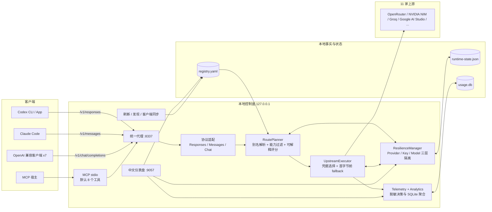
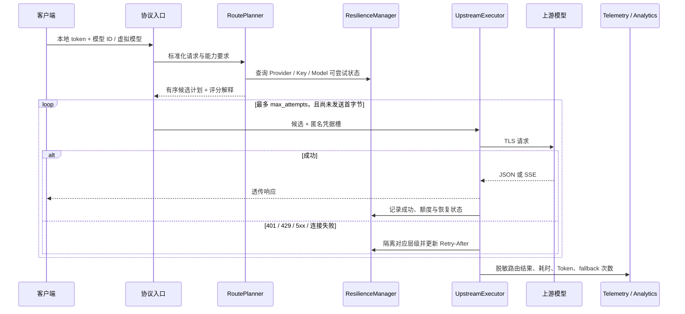

# 模力自由港系统架构

本文描述 `open-free-router` v0.3.0 的实际运行架构、请求生命周期、状态边界与扩展点。公开网站 [oaf.asia](https://oaf.asia) 只展示脱敏目录和服务器探测快照；本地代理、凭据、路由状态与使用统计均留在用户设备。

## 1. 总体结构

核心原则是“一个入口、一个事实源、三层保护、首字节边界”：所有客户端连接本地代理；`registry.yaml` 决定模型与提供商；Provider、凭据槽、模型分别隔离故障；流式响应只有在首字节前允许换候选，开始向客户端发送后绝不重放。

## 2. 请求生命周期

- 显式模型默认不静默换模；虚拟模型 `auto`、`auto/coding`、`auto/fast`、`auto/free` 可按策略选择候选。
- 可解释评分默认关闭；启用后综合健康度、成功率、延迟、额度、能力和免费证据，缺失值与权重均有明确口径。
- 上游响应头或 SSE 事件一旦发给客户端，就不再尝试其他候选，避免重复工具调用、重复计费或输出拼接。
- RateLimit、Retry-After 与额度只归一化为数字、分类和时间，不持久化原始敏感响应头。

## 3. 进程与线程

`open-free-router serve` 在一个 Python 进程内启动：

| 组件 | 实现 | 职责 |
|---|---|---|
| 推理代理 | `ThreadingHTTPServer`，端口 8337 | 鉴权、协议转换、路由、fallback、流式透传 |
| 本地仪表盘 | `ThreadingHTTPServer`，端口 9057 | 配置、模型、实测、路由、韧性与指标 |
| 刷新调度器 | 后台线程，默认每 12 小时 | 从已登记提供商刷新模型 |
| 发现调度器 | 后台线程，默认每 24 小时 | 生成候选；自动实测/接入必须显式开启 |
| MCP 服务 | 独立 stdio 进程 | 默认 8 个查询、推理与只读诊断工具；写工具需显式开启 |

推理代理与 UI 默认只监听 `127.0.0.1`。它们没有面向公网设计的 TLS、用户体系或细粒度 RBAC，不应直接暴露到互联网。

## 4. 协议与接口

| 表面 | 路径 / 传输 | 说明 |
|---|---|---|
| OpenAI Chat | `POST /v1/chat/completions` | 文本、流式、工具、usage 与 finish reason |
| OpenAI Responses | `POST /v1/responses` | Codex 所需事件与 function tool 转换 |
| Anthropic Messages | `POST /v1/messages` | Claude Code content blocks、tool_use 与类型化 SSE |
| Token 估算 | `POST /v1/messages/count_tokens` | 本地估算，不发往上游 |
| 兼容透传 | `/v1/completions`、`/v1/embeddings` | 传统补全与向量接口 |
| 运行时诊断 | `/api/resilience`、`/api/routes`、`/api/metrics` | 需本地代理 token，仅返回脱敏状态 |
| MCP | stdio JSON-RPC 2.0 | 默认 8 个工具；`mcp.allow_write_tools: true` 后为 10 个 |

声明兼容性由 `open-free-router protocols` 输出，真实在线状态由本地 Probe 或 Cloudflare 服务器探测产生；二者不能互相替代。详细验收项见 [protocol-capability-matrix.md](protocol-capability-matrix.md)。

## 5. 本地数据与权限

| 数据 | 默认位置 | 内容与权限 |
|---|---|---|
| 主配置 | `~/.config/open-free-router/config.yaml` | 端口、调度、路由、分析与 MCP 开关；写入前备份 |
| 注册表 | `~/.config/open-free-router/registry.yaml` | 提供商、模型与上游 Key；0600，敏感 |
| 代理令牌 | `~/.config/open-free-router/proxy.token` | 下游推理鉴权；0600 |
| UI 令牌 | `~/.config/open-free-router/ui.token` | 仪表盘写操作鉴权；0600 |
| 运行时状态 | `~/.local/share/open-free-router/runtime-state.json` | Provider / 匿名 Key 槽 / Model 状态；0600、原子写入 |
| 使用统计 | `~/.local/share/open-free-router/usage.db` | 脱敏事件摘要与聚合；0600，默认保留 30 天 |
| 路由决策 | 内存有界队列 | 候选、原因与耗时；不含原始请求 ID、Prompt 或响应 |
| 发现候选 / Probe | data 目录 JSON | 候选与最小实测快照，不含 Key 值 |

`usage.db` 不记录 Prompt、响应正文、工具参数、完整请求头或 API Key。设置 `analytics.retention_days: 0` 会完全关闭并避免创建数据库。

## 6. 安全边界

1. **客户端边界**：九类客户端只得到本地代理 token，不得到上游 Key。
2. **路由边界**：请求只能解析到注册表白名单；候选必须通过能力、证据、额度与韧性过滤。
3. **写操作边界**：UI 写接口需要 UI token；MCP 的刷新和同步工具默认隐藏。
4. **流式边界**：只在首字节前 fallback；首字节后禁止重放。
5. **持久化边界**：运行时状态与统计使用匿名槽位和字段白名单，不保存内容数据。
6. **公开网站边界**：Cloudflare Worker 只读取部署时公开资产、KV 状态与专用 Secrets，不能访问用户电脑的 `registry.yaml`、Key 或统计库。

### 6.1 公开评测数据流

公开评测页把三种数据保持在独立证据层，避免把“能用”“功能多”和“回答质量高”混成同一个结论：

1. Cloudflare Cron 的最小真实请求写入服务器端可用性与延迟快照；
2. 脱敏公开目录提供上下文、输出、推理、工具调用和结构化免费证据；
3. `scripts/import-artificial-analysis.mjs` 可从官方 API 或审计过的离线 JSON 快照提取公开评分字段，保留来源、Index 版本、导入时间与保守模型匹配。

导入器只从 `ARTIFICIAL_ANALYSIS_API_KEY` 环境变量读取凭据，不把 Key、原始响应或未匹配模型的猜测写入静态站点。外部导入失败时原有快照不被覆盖。

### 6.2 npm 分发层

`npm/open-free-router` 是 Python CLI 的薄封装，不形成第二套路由实现。首次运行时检测 Python 3.11+，在用户缓存目录建立按版本隔离的虚拟环境，并从 npm tarball 内的 `vendor/open-free-router` 安装同版本 Python 包。虚拟环境写入版本标记，后续直接复用；启动器不读取上游 API Key。npm 发布会公开随包源码，因此打包验证与正式发布是两个独立动作。

## 7. 主要模块

| 模块 | 职责 |
|---|---|
| `proxy.py` | HTTP 入口、鉴权、协议分派与响应边界 |
| `routing.py` | 虚拟模型、能力过滤与确定性候选计划 |
| `scoring.py` | 可解释六因子评分 |
| `executor.py` | 多凭据执行、首字节前 fallback 与上游错误分类 |
| `resilience.py` | Provider / Key / Model 三层隔离、冷却与原子恢复 |
| `quota.py` | 限流与额度响应头归一化 |
| `telemetry.py` | 有界脱敏路由决策 |
| `analytics.py` | SQLite 保留、聚合与安全导出 |
| `responses.py` | Responses 与 Chat Completions 双向适配 |
| `anthropic.py` | Messages 与 Chat Completions 双向适配 |
| `registry.py` / `config.py` | 注册表模型、配置与安全持久化 |
| `discovery.py` / `refresh.py` | 候选发现与已登记目录刷新 |
| `evidence.py` | 免费额度证据解析、继承、有效期与状态 |
| `protocol_matrix.py` | Provider × 三协议声明能力与诊断 |
| `sync.py` | 九客户端配置的幂等同步与密钥隔离 |
| `mcp_server.py` | MCP 工具目录、权限开关与 stdio JSON-RPC |
| `ui.py` / `probe.py` | 中文本地控制台与真实最小请求探测 |
| `serve.py` / `cli.py` | 守护进程编排与 16 个顶层 CLI 命令 |

## 8. 扩展方式

- 新提供商：在 `registry.default.yaml` 登记基础信息；需要自动刷新时，在 `refresh_sources/` 增加 `fetch(upstream_url, api_key)`。
- 新客户端：在 `sync.py` 增加保留用户配置的幂等适配器，并加入密钥隔离测试。
- 新协议：先扩展协议能力矩阵与跨协议验收，再接入代理分派；不得只以静态声明替代真实行为测试。
- 新路由因子：必须归一化到 `[0,1]`、定义缺失值、公开权重与贡献，并保证关闭开关后恢复确定性顺序。

网站架构页是本文的可视化摘要；本文与源码、测试共同作为 v0.3.0 的详细技术说明。
